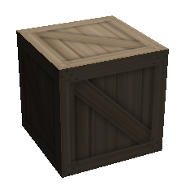
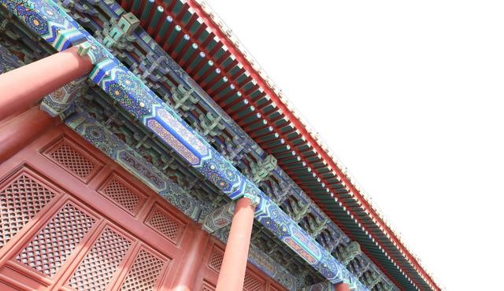

### 贴图

纹理映射（Texture Mapping）

就是将一张或者多张图片贴在一个对象或者一个多面体（3d对象上面）

### UV映射

（UV Mapping）

把平面图像的不同区块映射到3D模型的不同面上去。

比如：

讲多张图片合并成一张大图。

这是一张大图，然后将这张大图的每一个四边形的区域，画到一个正方体上面。

### 法线贴图

（Normal Mapped）

例如, 一个法线 (-1, 0, 1) 会被作为 RGB 编码为 (0, 0.5, 1). x 轴(左/右)被保存到红色通道, y 轴(上/下)被保存到绿色通道, z 轴(前/后)被保存到蓝色通道. 最终的法线图(normal map)看起来就是下面这个样子:

然后用上原本的纹理：

这样生成的效果如下：（当然是加了光源，这样看起来比较明显）

那么我们用文字来描述这种效果就是：

对于视觉效果而言，它的效率比原有的凹凸表面更高，若在特定位置上应用光源，可以让细节程度较低的表面生成高细节程度的精确光照方向和反射效果

注意，它本质上也是一个平面，但是不像普通贴图那样只是一个光滑的平面。

### 高动态范围 

High-Dynamic Range，简称HDR

就拿照相来说明一下吧：

我们将焦点对准建筑物，就会发现远处的天空看不到。

我们将焦点对准了蓝天，建筑物就变得有点暗。

HDR呢，就是拍摄多张不同曝光程度的照片，然后自动合成，从而来实现暗部细节明显，亮处有过曝的效果。效果如下：

### 曲面细分

Tessellation

在dx11引入了一种新科技。我们先来看一下对比图。

开启了曲面细分后，看到人物模型轮廓已经相当平滑了，使得游戏画面更加真实。

好处如下：

1. 动态LOD（levels of detail，细节层次），我们可以基于摄像机的远近和其它因素决定要产生的细节丰富度。如果我们离物体比较远，就没有必要产生那么多模型面数。
1. 使物理和动画模拟更加高效。低面数模型来计算物理和动画，可以使得计算效率更加高，接着再曲面细分，达到更逼真的显示效果。
1. 节约内存。我们可以节约硬盘容量、CPU内存、GPU显存，在计算的时候再凭空新增细节顶点。

其原理就是用到了贝塞尔曲线。只是扩展到了3d世界。

